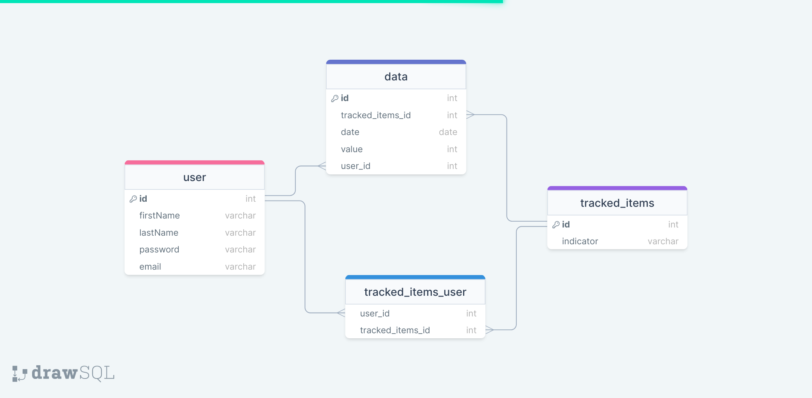
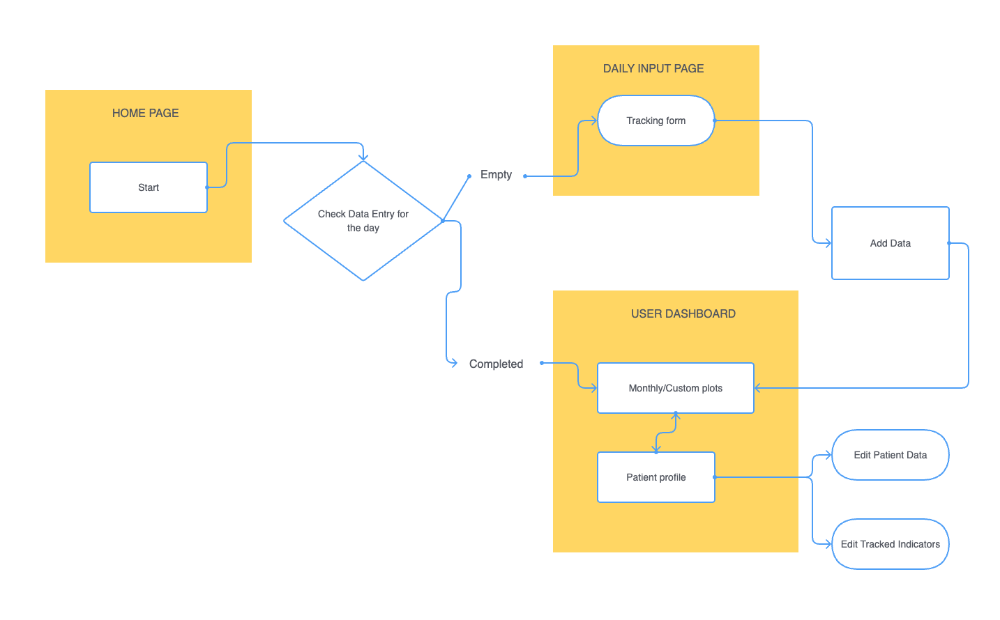

<h1> <b>Mind Connect</b> </h1>

<h2> By Veronica Baldin </h2>

   <a href="https://github.com/VeronicaBal/mindconnect">**Explore the docs »**</a>
    <br />
    <br />
    <a href="https://user-images.githubusercontent.com/113427751/208163535-625b0d13-059d-4227-8f85-bcb1750028bc.mov">View Demo</a>
    ·
    <a href="https://github.com/VeronicaBal/mindconnect/issues">Report Bug</a>
    ·
    <a href="https://github.com/VeronicaBal/mindconnect/issues">Request Feature</a>
  </p>
</div>
<br>
<details>
  <summary>Table of Contents</summary>
  <ol>
    <li>
      <a href="#introduction">Introduction</a>
    </li>
    <li>
      <a href="#motivation">Motivation</a>
    </li>
    <li>
      <a href="#tools-used">Tools Used</a>
    </li>
    <li>
      <a href="#getting-started">Getting Started</a>
      <ul>
        <li><a href="#prerequisites">Prerequisites</a></li>
        <li><a href="#installation">Installation</a></li>
      </ul>
    </li>
    <li><a href="#database-schema">Database Schema</a></li>
    <li><a href="#api-routes">API Routes</a></li>
    <li><a href="#api-routes">User flow diagram</a></li>
    <li><a href="#future-features">Future Features</a></li>
    <li><a href="#contact">Contact</a></li>
    <li><a href="#acknowledgments">Acknowledgments</a></li>
  </ol>
</details>

## Introduction

Mind Connect is a mental health tracker designed for patients who need to track specific mental-health indicators during the course of psychological or farmaceutical interventions. 

https://user-images.githubusercontent.com/113427751/208163535-625b0d13-059d-4227-8f85-bcb1750028bc.mov


<p align="right">(<a href="#readme-top">back to top</a>)</p>


## Motivation

When receiving treatment, it can be difficult to objectively track the evolution of mental-health-related symptoms over time. Moreover, many patients receive treatment from different mental health professionals who can’t always have access to the shared patient folders nor communicate about the patient evolution. 

Mind Connect enables users to track different different mental health indicators (customizable) over a span of time and see how this evolution plots over time.


Users can track mental health-related symptoms on a scale from 0 to 10 and visualize their evolution on a line plot.
Users can input their own mental health indicators and filter the plotted data based on month or by choosing a custom time frame.

<br>
<p align="right">(<a href="#readme-top">back to top</a>)</p>

## Tools Used
* VS Code
* Github
* Gitbash
* Postman
* MySQL
* HTML
* CSS
* JavaScript
* React.js
* Bootstrap
* Node.js
* Express
* Recharts
* Luxon
* React Router
* DrawSQL

<p align="right">(<a href="#readme-top">back to top</a>)</p>


## Getting started 

### Prerequisites
- npm
- node
- mySQL


### Installation

1. Create a .env file:

  ```
  DB_HOST = localhost
  DB_NAME = userdata
  DB_USER = // your db username
  DB_PASS = // your db password
  TZ = UTC
  ```

2. To run the database, type 'mysql' into the terminal and run the following command:
 ```sh
  CREATE DATABASE userdata;
  ```

3. Install NPM packages on both the server and on the client.
```
npm install
```

4. Make sure to populate your database with the correct info by typing this on the server side:
```
npm run migrate
```

5. To run the backend, type in the server side:
```
npm start
```

6. In a second terminal window, type 'cd client' to get into the front-end folder, then type:
```
npm start
```

 Frontend runs on http://localhost:3000, and backend runs on http://localhost:5000.

 <p align="right">(<a href="#readme-top">back to top</a>)</p>
 
 
## Database Schema


<p align="right">(<a href="#readme-top">back to top</a>)</p>


## API routes
You can access a table describing all API routes [here](https://docs.google.com/document/d/1O1U_3h51VFvR2mhPNw2iAyywcwley3MX2vSJr88UJQ0/edit?usp=sharing)


## User flow diagram


<p align="right">(<a href="#readme-top">back to top</a>)</p>


## Future features:
- Disable submit buttons if forms incomplete
- Log-in and sign-up 
- Different access for mental-health professionals
- Comments in progress view
- Notifications
- Include changes of medication in plot


### Instructions to add features:
1. Fork the Project
2. Create your Feature Branch (`git checkout -b feature/MyFeature`)
3. Commit your Changes (`git commit -m 'Added MyFeature'`)
4. Push to the Branch (`git push origin feature/MyFeature`)
5. Open a Pull Request

<p align="right">(<a href="#readme-top">back to top</a>)</p>

## Contact

Veronica Baldin - [LinkedIn](https://www.linkedin.com/in/veronica-baldin/)

<p align="right">(<a href="#readme-top">back to top</a>)</p>

## Acknowledgements


* Instructor [Jim Rudolf](https://github.com/jbrcodes)
* TA [Lucie Baborová](https://github.com/lucieBBR)
* TA [Maria Llaverias Pugliese](https://github.com/mariallaverias)
* TA [Pia Prozesky](https://github.com/piaprozesky)


### Thank you for all your help!<br>


_This is a student project that was created at [CodeOp](http://codeop.tech), a full stack development bootcamp in Barcelona._

<p align="right">(<a href="#readme-top">back to top</a>)</p>
